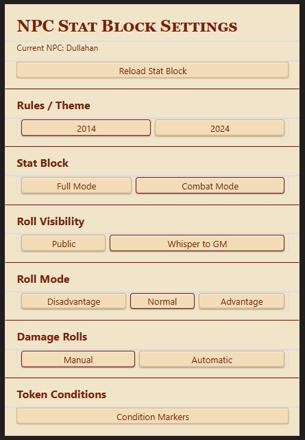
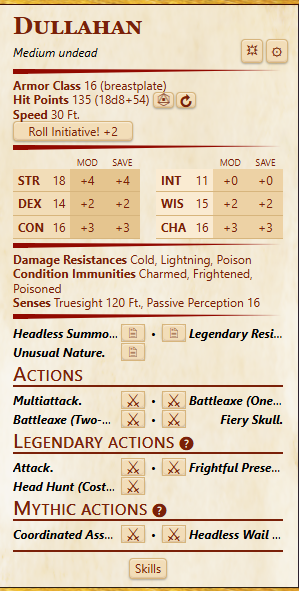
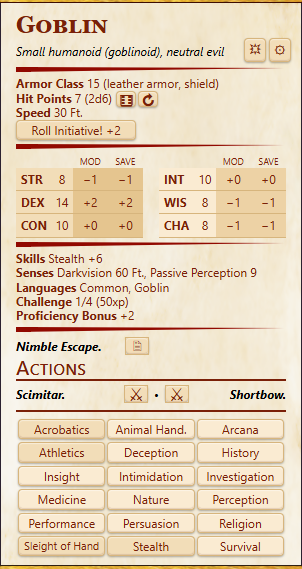
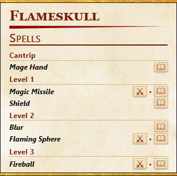
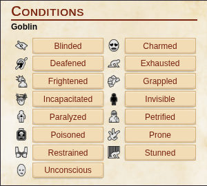
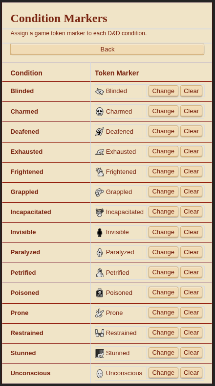

# Tim's NPC Stat Block Mod v5.5.0

A compact NPC stat block for Roll20, built with ScriptCards.

Select an NPC token, run the macro, and the script prints a chat stat block with clickable buttons for checks, saves, skills, initiative, traits, actions, spells, recharge rolls, token HP controls, and token condition management.

The Mod is designed to resemble official D&D NPC stat blocks as closely as possible while still keeping Roll20 functionality practical at the table.


*Screenshot reference: The main NPC stat block using the 2014 theme in Full Mode, showing the NPC header, core stats, ability/save grid, skills, actions, and header tools.*

---

## Support Status

### Officially Supported

- **D&D 5E 2014 by Roll20**

### Experimental Support

- **Beacon character sheet**

Beacon support is currently **experimental only** and requires the [Beacon-compatible experimental version of ScriptCards](https://github.com/VirulentArc/ScriptCards/tree/main/D%26D2024%20Beacon). It is not part of the normal public ScriptCards release at this time.

The Mod also supports both **2014** and **2024** presentation styles. The selected Rules/Theme setting is separate from the sheet type, so either supported sheet can display either theme.

---

## Features

- Displays an NPC stat block directly in chat.
- Mimics official **2014** and **2024** NPC stat block presentation as closely as practical.
- Supports the **2014 Roll20 5E NPC sheet**.
- Includes **experimental Beacon support** when used with the Beacon experimental ScriptCards build.
- Includes clickable buttons for:
  - ability checks
  - saving throws
  - skills
  - initiative
  - traits
  - actions
  - bonus actions
  - reactions
  - legendary actions
  - mythic actions
  - spells
- The Settings handout includes **Disadvantage / Normal / Advantage** roll modes.
- The Settings handout includes **Public / Whisper to GM** roll visibility.
- The Settings handout includes **Manual / Automatic** damage rolls.
- Includes **Full Mode** and **Combat Mode** display options, selected from the Settings handout.
- Includes a **Spells** card for supported 2014 NPC spellcasting.
- Includes tooltips for traits, actions, and spells so the GM can review full text without sending it to chat.
- Includes a **Recharge** button for abilities with Recharge text.
- Includes a token-only **HP roll** button for NPCs with an HP formula.
- Includes a token-only **HP reset** button to restore HP from the sheet value.
- Includes a **Manage Conditions** button for applying and removing token condition markers.
- Includes configurable condition marker mappings stored in the settings handout.
- Automatically respects **Condition Immunities** when showing available conditions.
- NPC names on the card link directly to the Roll20 journal entry.
- Automatically creates and uses a shared **NPC Stat Block Settings** handout.

---

## Requirements

### For Officially Supported 2014 Use

- A Roll20 Pro game with Mod/API access.
- ScriptCards installed in the game.
- The official **D&D 5E 2014 by Roll20** character sheet.
- An NPC character sheet.
- A token linked to that NPC sheet.

### For Experimental Beacon Use

- A Roll20 Pro game with Mod/API access.
- The [**Beacon-compatible experimental ScriptCards build**](https://github.com/VirulentArc/ScriptCards/tree/main/D%26D2024%20Beacon).
- A Beacon NPC sheet.
- A token linked to that NPC sheet.

---

## Installation

### D&D 5E 2014

1. Install the normal release of **ScriptCards** in your Roll20 game.
2. Copy the full contents of `NPC_Statblock_v5.5.0.scard`.
3. In Roll20, open the **Collections** tab.
4. Create a new macro, such as `NPC-Statblock`.
5. Paste the full NPC Stat Block script into the macro.
6. Save the macro.
7. Select a token that represents an NPC character.
8. Run the macro.

The NPC Stat Block script is installed as a Roll20 **Game Macro**. It is not a separate Mod/API script.

### Experimental Beacon

Beacon requires the experimental Beacon-compatible build of ScriptCards instead of the normal ScriptCards release.

1. Go to the [D&D 2024 Beacon folder in the ScriptCards GitHub repository](https://github.com/VirulentArc/ScriptCards/tree/main/D%26D2024%20Beacon).
2. Open the current Beacon-compatible ScriptCards `.js` file and copy its complete contents.
3. In Roll20, open your game's **Mod (API) Scripts** page.
4. Create a new custom Mod script and give it a name such as `ScriptCards-Beacon`.
5. Paste the complete Beacon-compatible ScriptCards JavaScript into the new Mod script and save it.
6. If the normal release of ScriptCards is already installed in the game, disable or remove it while using the Beacon build. **Do not run both versions of ScriptCards at the same time.**
7. Copy the full contents of `NPC_Statblock_v5.5.0.scard`.
8. In Roll20, open the **Collections** tab and create a new Game Macro, such as `NPC-Statblock`.
9. Paste the full NPC Stat Block script into the macro and save it.
10. Select a token representing a Beacon NPC and run the macro.

The experimental Beacon ScriptCards build replaces the normal ScriptCards Mod for Beacon use. The NPC Stat Block itself is still installed as a **Game Macro** in the same way as the 2014 version.

For updates, replace the entire NPC Stat Block macro with the newest full script. Large ScriptCards macros are easiest to maintain in an external editor, then copied into Roll20 as one complete block.

---

## Quick Start

1. Select one NPC token.
2. Run the `NPC-Statblock` macro.
3. Use the buttons on the stat block.
4. If needed, click the **gear** button to open the shared settings handout.

The macro will show an error if:

- no token is selected
- more than one token is selected
- the token does not represent a character
- the represented character is not an NPC

---

## First Run

The first time the macro runs, it creates an archived handout named:

```text
NPC Stat Block Settings
```

This handout stores the Mod's shared settings, including:

- Roll Visibility
- Roll Mode
- Damage Rolls
- Full/Combat mode
- Rules/Theme
- Condition Marker mappings

Do not edit the GM Notes of this handout unless you are intentionally resetting or repairing the settings.

If the handout is deleted, the script will recreate it the next time the macro runs.



*Screenshot reference: The NPC Stat Block Settings handout showing Rules/Theme, Full/Combat mode, Roll Visibility, Roll Mode, Damage Rolls, and the link to Condition Marker settings.*

---

## Display Modes

The stat block has two display modes.

### Full Mode

Full Mode shows the most complete version of the NPC entry. It includes the NPC's core statistics, full ability and saving throw block, skill buttons, combat defenses, senses, languages, challenge, proficiency bonus, traits, actions, bonus actions, reactions, legendary actions, mythic actions, and spell access when available.

### Combat Mode

Combat Mode is a tighter table-use view. It keeps combat-relevant information visible while moving the full skill grid onto a separate **Skills** button.

Traits are still shown in Combat Mode, because many NPC traits are important during combat.



*Screenshot reference: The main NPC stat block in Combat Mode, showing the compact combat-focused layout and the separate Skills button.*

### Switching Modes

Open the **NPC Stat Block Settings** handout with the gear button and choose **Full Mode** or **Combat Mode** under **Stat Block**.

The selected mode is saved in the settings handout and is shared for the game. Use **Reload Stat Block** in the handout to redraw the current NPC after changing settings.

---

## Rules / Theme

The Mod supports both **2014** and **2024** visual presentation styles.

(images/goblin2024.png)

*Screenshot reference: A side-by-side comparison of the same NPC displayed with the 2014 theme and the 2024 theme.*

This is a display setting, not a sheet-type lock.

That means:

- a supported 2014 sheet can be displayed in 2014 or 2024 style
- a supported Beacon sheet can be displayed in 2014 or 2024 style

The setting is saved in the shared settings handout.

---

## Header and Settings Controls

The v5.5.0 stat block keeps the main card controls deliberately small.

### Header Tools

The header contains:

- **Spells** — opens the separate Spells card when spell data is available on a supported 2014 NPC.
- **Manage Conditions** — opens the condition manager for the selected token.
- **Settings** — the gear button opens the **NPC Stat Block Settings** handout.

### Settings Handout

The Settings handout contains the persistent controls for the Mod:

- **Rules / Theme** — 2014 or 2024.
- **Stat Block** — Full Mode or Combat Mode.
- **Roll Visibility** — Public or Whisper to GM.
- **Roll Mode** — Disadvantage, Normal, or Advantage.
- **Damage Rolls** — Manual or Automatic.
- **Condition Markers** — configure the token marker assigned to each supported condition.

After changing settings, use **Reload Stat Block** in the handout to redraw the currently selected NPC with the new settings.

---

## Reading the Stat Block

The card is designed to remain compact.

Long descriptive text is shortened on the visible card, but full cleaned text remains available in tooltips.

The card can show:

- NPC name and type
- Armor Class
- Initiative
- Hit Points and HP formula
- Speed
- Ability scores and modifiers
- Saving throw buttons
- Skill buttons
- Damage vulnerabilities, resistances, and immunities
- Condition immunities
- Senses
- Languages
- Challenge Rating and XP
- Proficiency Bonus
- Traits
- Actions
- Bonus Actions
- Reactions
- Legendary Actions
- Mythic Actions
- Spells, when available

Only sections with usable data are shown.

---

## Rolling from the Card

Most buttons roll using Roll20's normal NPC roll output.

### Ability Checks and Saving Throws

Click an ability score button to roll an ability check.

Click the save button under an ability to roll that ability's saving throw.

If the NPC has a listed save bonus, the save button uses that listed bonus. Otherwise it falls back to the ability modifier.

### Skills and Initiative

In Full Mode, skill buttons appear directly on the main card.

In Combat Mode, click **Skills** to open a separate skill card.

Initiative uses the NPC's initiative bonus when present. If no separate initiative bonus exists, it falls back to Dexterity. Initiative rolls respect the current **Roll Mode** setting and update the turn order for the selected token.

### Actions

Attack actions use native NPC attack output.

Non-attack actions use the sheet's own action output when appropriate.

### Traits

Traits appear in both Full Mode and Combat Mode. This is intentional.

Many NPC traits are rules-critical during combat, such as Magic Resistance, Legendary Resistance, Pack Tactics, Regeneration, or sunlight-related weaknesses.

---

## Spells

On supported **2014 NPC sheets**, NPCs with spellcasting data receive a **Spells** button.

Click **Spells** to open a separate spell list card.

The dedicated Spells card is not currently part of the experimental Beacon path.



*Screenshot reference: The separate Spells card opened from an NPC stat block, showing several spell levels and spell rows/buttons.*

Spells are grouped by level:

- Cantrips
- Level 1 through Level 9

Spell rows can show:

- spell name
- compact description
- tooltip details
- native cast button when available
- native description button when available

Tooltips can include:

- school
- casting time
- range
- target
- components
- ritual tag
- concentration tag
- duration
- innate spell text
- description
- higher-level text

This script displays and rolls NPC spells. It does not manage spell slots or spell preparation.

---

## Recharge Rolls

If an action includes a Recharge entry such as **Recharge 5–6**, the action receives a Recharge button.

Clicking that button rolls the recharge check and reports whether the ability recharges.

Recharge output follows the current whisper setting.

---

## Token Hit Point Controls

If the NPC has an HP formula, the card shows a roll button beside the HP formula.

Clicking it rolls the NPC's HP formula and applies the result to the selected token's **current and maximum HP**.

- This affects the **selected token only**.
- It does **not** change the character sheet.
- If the rolled result is **0 or lower**, it is forced to **1**.

A second button resets the token's HP to the sheet HP value.

---

## Manage Conditions

The Mod includes a **Manage Conditions** card for the selected token.



*Screenshot reference: The Manage Conditions card for a selected NPC token, showing available condition buttons with at least one active condition highlighted.*

Supported conditions are:

- Blinded
- Charmed
- Deafened
- Exhausted
- Frightened
- Grappled
- Incapacitated
- Invisible
- Paralyzed
- Petrified
- Poisoned
- Prone
- Restrained
- Stunned
- Unconscious

The card lets the GM quickly apply or remove those conditions as token markers.

If the NPC has Condition Immunities, immune conditions are automatically omitted from the list.

---

## Condition Marker Settings

Condition marker mappings are stored in the shared settings handout.



*Screenshot reference: The Condition Marker settings page in the NPC Stat Block Settings handout, showing assigned markers and the Change/Clear controls.*

On first setup, the Mod attempts to auto-match Roll20's default token markers by name where possible.

Examples:

- Blinded → Blinded
- Charmed → Charmed
- Exhausted → Exhausted
- Stunned → Stunned

If needed, the GM can manually change or clear each mapping from the settings handout.

Condition mappings are shared in the game.

---

## Shared Settings

The script stores these settings in the `NPC Stat Block Settings` handout:

| Setting | What it controls |
| --- | --- |
| Roll Visibility | Public or Whisper to GM. |
| Roll Mode | Disadvantage, Normal, or Advantage. |
| Damage Rolls | Manual or Automatic. |
| Stat Block | Full Mode or Combat Mode. |
| Rules / Theme | 2014 or 2024 presentation style. |
| Condition Markers | Which token marker is assigned to each supported condition. |

These settings are shared for the game.

---

## What the Script Changes

The script reads the selected NPC sheet and displays a chat stat block.

It does not rewrite the NPC's stat block contents.

To keep native sheet output consistent with the Mod's settings, the script may synchronize the relevant NPC sheet roll settings, such as roll visibility and damage behavior. The experimental Beacon path also synchronizes its native roll mode.

The script can also:

- update the selected token's HP bars when using the HP controls
- update the selected token's condition markers when using Manage Conditions
- update the turn tracker when rolling initiative

It does **not** use the token HP controls or condition tools to change the character sheet itself.

---

## Updating from Older Versions

Older versions of this project used a ScriptCards template mule and a custom stat block template. Version 5.5.0 no longer requires that setup.

You do not need:

- `ScriptCards_TemplateMule`
- `statblockv4`
- stored ScriptCards templates
- `!sc-reloadtemplates`

You can leave old template material in your game if other scripts still use it, but this NPC Stat Block Mod no longer depends on it.

---

## Troubleshooting

### No token is selected

Select exactly one NPC token, then run the macro again.

### More than one token is selected

Deselect the extra tokens. The macro only works with one selected token at a time.

### The token is not linked to a character sheet

Open the token settings and make sure **Represents Character** is set to the NPC character sheet.

### The selected character is not an NPC

Open the character sheet and confirm it is configured as an NPC on the supported sheet.

### The card does not show spells

Make sure the NPC has spellcasting data on the NPC sheet. The **Spells** button only appears when the script can read usable spell data.

### Rolls are whispered or public unexpectedly

Open **NPC Stat Block Settings** and check **Roll Visibility**. Choose **Public** or **Whisper to GM** as needed.

### Damage is not rolling the way you want

Open **NPC Stat Block Settings** and check **Damage Rolls**.

- **Manual** uses the normal damage buttons/links.
- **Automatic** includes damage with the attack output.

### The card is too large in chat

Open **NPC Stat Block Settings** and choose **Combat Mode** under **Stat Block**. Combat Mode keeps combat-relevant information visible while moving the full skill grid to the **Skills** button.

### Long text is cut off

Hover over the row. Long text is intentionally shortened on the card, and the full cleaned text is available in the tooltip.

### Condition markers are missing or wrong

Open the settings handout and review the Condition Marker mappings.

### The settings handout was deleted

Run the macro again. The script will recreate `NPC Stat Block Settings` with default settings.

### The macro behaves strangely after editing it in Roll20

Replace the entire macro from a clean copy of `NPC_Statblock_v5.5.0.scard`. For large ScriptCards macros, editing in an external editor and then pasting the whole script back into Roll20 is usually safer than making piecemeal edits in the Roll20 macro editor.

---

## Credits

Created by Timothy Beasley for Roll20 using ScriptCards.
