# Spell Book Manager

Spell Book Manager is a ScriptCards utility for Roll20 D&D 5E 2014 games. It lets a GM maintain one or more spell mule source characters and lets players copy approved spells from those sources onto their own character sheets.

Spell Book Manager can also manage assigned spell book characters, copy spells between mule source characters, add spells to NPC sheets, and move a character's existing leveled spells up or down between spell levels. The move feature is especially useful for Warlocks and other cases where the same spell may need to live at a different slot level.

The script is designed for the official D&D 5E 2014 by Roll20 character sheet and works with normal PC spell rows. NPC support is available through the GM-only NPC Spell Manager.

---

## Requirements

- A Roll20 Pro account with Mod/API access.
- ScriptCards installed.
- ScriptCards 3.0.22 or newer is required. If Roll20 One-Click has an older ScriptCards version, install ScriptCards manually before using Spell Book Manager.
- The official D&D 5E 2014 by Roll20 character sheet.
- One or more spell source characters whose names begin with `SBM_`.

---

## Installation

1. Install ScriptCards in your Roll20 game.
2. Create a new Macro named `Spell-Book-Manager`.
3. Paste the full `Spell_Book_Manager.scard` script into that macro.
4. Run the script once as the GM.
5. On first run, the script will create these handouts automatically:
   - `Spell Book Manager Settings`
   - `Spell Book Manager [PlayerID]`

The settings handout stores GM configuration. The player-specific handout is used to display spell descriptions when the spell description button is clicked.

The first time each player runs the script, a new `Spell Book Manager [PlayerID]` handout will be created.<br>
All automatically created handouts are stored as archived as to not interfere with game journals.<br>


GMs will see a string of characters in the GM Notes of the handouts. Do not manually edit the GM Notes. That text is a JSON string that stores mule assignment information and player theme information.<br>


---

## Basic Player Use

Run Spell Book Manager from the macro bar or collections tab.

If the player controls only one valid PC, the script will go directly to that character's spell options. If the player controls more than one valid PC, the script will ask which character to manage.

Players can normally:

1. Choose a character.
2. Click **Choose Spells** to browse available spells.
3. Click **Copy to Character** to copy a spell onto the character sheet.
4. Click the &#x1F56E; description button beside a spell to write that spell's formatted description to the Spell Book Manager handout.


If the character is a Warlock, or if the GM is managing the character, the **Move Spells** button is also available.


If the character has an assigned spell book, the character options page can also show **Copy to Spell Book**. This lets a player copy spells from their approved spell sources into the assigned spell book rather than directly onto the character.

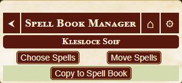

If the character already knows a spell with the same name, Spell Book Manager marks that spell as **Already Known** instead of offering another copy button. The spell list may need to be refreshed before this status updates after a copy.

---

## Choose Spells


**Choose Spells** shows spells available to the selected character.

1. Click **Spell Description Handout** to open the Spell Book Manager handout.
2. Click the &#x1F56E; button beside a spell to write that spell's formatted description to the handout.
3. Click **Copy to Character** to copy a spell onto the character sheet.

Spell availability normally comes from two sources:

1. Class spell sources assigned by the GM.
2. Character-specific spell source settings assigned by the GM.

If more than one spell source is available, Spell Book Manager shows a spell source selection page. Players can choose **All Spells** or a specific assigned source.

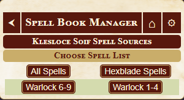

Spells are grouped by spell level and sorted alphabetically. If multiple assigned sources contain a spell with the same name at the same level, the spell is only shown once in the chooser.

When a spell is copied, the script copies the full spell row to the character sheet and preserves important spell text fields such as name, description, and At Higher Levels text.

### Characters with assigned spell books

If the selected character has an assigned spell book, **Choose Spells** uses that assigned spell book as the source instead of showing the normal spell source picker. In that workflow, the spell book acts as the character's curated or prepared list, and **Choose Spells** copies from the spell book onto the actual character sheet.

Use **Copy to Spell Book** to add spells into the assigned spell book first.

---

## Copy to Spell Book


**Copy to Spell Book** appears when a character has a spell book assigned by the GM.

This feature is intended for characters that should maintain a separate spell book, preparation list, research list, or other curated personal spell collection.

For players, **Copy to Spell Book** allows copying from the character's approved spell sources into the assigned spell book. Players do not get unrestricted access to every `SBM_` spell source.

For GMs, **Copy to Spell Book** can use any active `SBM_` spell source as the source list, while still copying into the selected character's assigned spell book.

To use Copy to Spell Book:

1. The GM assigns one `SBM_` character as the selected character's spell book.
2. The player or GM clicks **Copy to Spell Book** from the character options page.
3. The user chooses a source spell list.
4. The user clicks **Copy to Spell Book** beside a spell.
5. The spell is copied into the assigned spell book character.
6. The character can then use **Choose Spells** to copy from that spell book onto their actual character sheet.


Only one spell book can be assigned to a character at a time.

---

## Move Spells


**Move Spells** allows a character's existing leveled spells to be moved up or down one spell level at a time.

This is intended mainly for Warlocks or other special cases where spells need to be shifted between spell levels after they are already on the character sheet.

Notes:

- Cantrips cannot be moved.
- Level 1 spells cannot be moved down.
- Level 9 spells cannot be moved up.
- Non-GM players only see **Move Spells** if the selected character is a Warlock.
- GMs can access move mode for any valid PC.

When moving Warlock-style scaling spells, Spell Book Manager attempts to preserve the spell's original baseline level and adjust simple dice expressions when appropriate.

See `Custom Spell Notes` further in the document for suggestions about custom Warlock spells.

---

## GM Tools

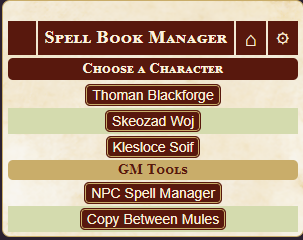

When the GM runs Spell Book Manager, the character selection page includes a **GM Tools** section.

GM tools include:

- **NPC Spell Manager**
- **Copy Between Mules**

These tools are only available to the GM.

---

## GM Settings


Click the settings button in the Spell Book Manager title bar to open settings.

GM settings include:

- Class spell source assignments.
- Character-specific spell source assignments.
- Character spell book assignments.
- Custom class management.
- Theme selection.

Player settings include:

- Theme selection.

Only the GM sees class source, character source, spell book assignment, and custom class management options.

---

## Spell Mule Characters

A spell mule is a normal Roll20 character sheet whose name begins with:

```text
SBM_
```

Examples:

```text
SBM_Wizard Spells
SBM_Cleric Spells
SBM_Xanathar Spells
SBM_Custom Warlock Spells
SBM_Huxley Spell Book
```

Put spells on the source as normal spell rows at the correct spell level. Spell Book Manager reads those spell rows and offers them to characters based on class, character, spell book, GM copy, or NPC manager workflows.

The `SBM_` prefix is only for identifying Spell Book Manager source characters. The prefix is removed from button display names inside the settings menu.

`SBM_` characters can be used in several ways:

- Class spell sources.
- Character-specific spell sources.
- Assigned spell books.
- GM-only copy destinations or copy sources.
- NPC Spell Manager sources.

A source assigned as a character's spell book should usually be treated as that character's personal spell book, not as a shared class source.

---

## Spell List Size and Roll20 Performance

Avoid putting too many spells on a single character sheet.

This includes player characters, NPCs, spell source characters, and assigned spell book characters. `SBM_` sources are still character sheets, and very large spell lists can make Roll20 slower or less reliable.

There is no exact universal spell limit. Some sheets may work fine with a large number of spells, while others may slow down or behave unpredictably depending on browser, computer, campaign size, and overall sheet data.

For best results, do not create one giant spell source containing every spell in the game. Split large spell libraries into smaller `SBM_` characters, such as class-based, source-based, subclass-based, player-specific, or campaign-specific spell sources.

If a character sheet or spell source starts loading slowly, failing to update correctly, or behaving strangely, reduce the number of spell rows on that sheet.

---

## Assigning Class Spell Sources


To assign spell sources by class:

1. Run Spell Book Manager as the GM.
2. Click the settings button.
3. Under **Class Spell Mules**, click a class.
4. Click an unassigned spell source to assign it to that class.
5. Click an assigned spell source to remove it from that class.

A character inherits spell sources from any matching class names found on their sheet, including multiclass fields.

Large available source lists use A-Z navigation so the GM does not need to scroll through every `SBM_` character at once.


---

## Character-Specific Spell Sources


Character-specific settings let the GM add or block spell sources for a specific character.

To manage character-specific spell sources:

1. Run Spell Book Manager as the GM.
2. Click the settings button.
3. Click **Character Assignments**.
4. Choose a character.
5. Use the available, added, inherited, and blocked lists to control that character's spell source access.

Character-specific source settings can:

- Add an extra source that the character does not inherit from class settings.
- Block an inherited class source for that character.
- Remove a previously added source.
- Unblock a previously blocked inherited source.

Assigned spell books are kept out of the normal available source lists so they are not accidentally assigned as shared spell sources.

---

## Spell Book Assignment

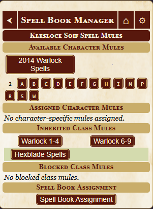

Spell Book Assignment is part of the character-specific settings page.

To assign a spell book to a character:

1. Run Spell Book Manager as the GM.
2. Click the settings button.
3. Click **Character Assignments**.
4. Choose a character.
5. Click **Spell Book Assignment**.
6. Choose one available `SBM_` character to use as that character's spell book.

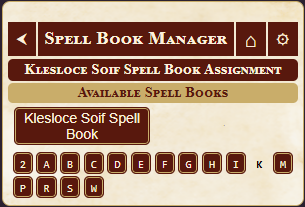

A character can have one assigned spell book. If a spell book is already assigned, the Spell Book Assignment page shows the assigned spell book instead of the available list. Click the assigned spell book to remove it, then choose a different one if needed.

Assigned spell books change the normal player workflow:

- **Copy to Spell Book** copies from approved sources into the assigned spell book.
- **Choose Spells** copies from the assigned spell book onto the actual character sheet.

This makes it possible to support a wizard-style workflow where the player has a separate spell book character and only moves selected spells onto the playable character sheet.

---

## Copy Between Mules

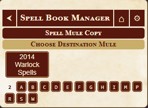

**Copy Between Mules** is a GM-only tool for copying spells from one active `SBM_` spell source to another.

The basic flow is:

1. Run Spell Book Manager as the GM.
2. On the character selection page, click **Copy Between Mules**.
3. Choose the destination mule.
4. Choose the source mule.
5. Click **Copy to Mule** beside the spells you want to copy.

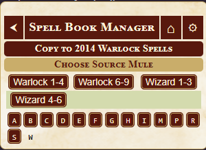

The source picker excludes the already-selected destination mule so the GM does not accidentally copy a mule into itself.

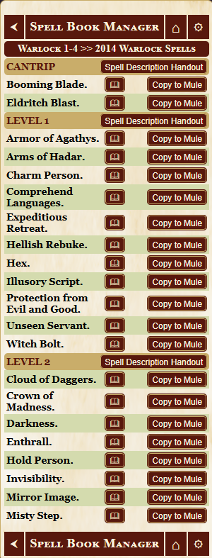

This is useful for building smaller campaign-specific, subclass-specific, or player-specific spell sources from larger source mules.

---

## NPC Spell Manager


**NPC Spell Manager** is a GM-only tool for copying spells from active `SBM_` spell sources onto NPC sheets.

The NPC picker lists NPC sheets separately from player characters.

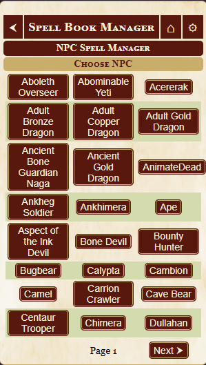

The basic flow is:

1. Run Spell Book Manager as the GM.
2. On the character selection page, click **NPC Spell Manager**.
3. Choose an NPC.
4. Choose a spell source.
5. Click **Copy to Character** beside the spells you want to add to the NPC.

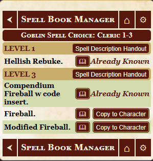

When a spell is copied to an NPC, Spell Book Manager enables the NPC spellcasting flag if needed so the spell section can appear on the NPC sheet.

NPC Spell Manager is intended for the official D&D 5E 2014 NPC sheet. It is separate from normal player character assignment settings and does not use class assignments.

---

## Custom Classes

The GM can add custom class names from the settings menu.

Use this if your game has a homebrew class, a sheet class name that is not part of the default class list, or a subclass that should have its own spell source assignments.

Custom class entries are matched against the class and subclass names on a character's sheet. If the custom entry matches either a character's class or subclass, Spell Book Manager applies the source assignments for that custom entry to that character.

For example, if the GM adds a custom class named `Eldritch Knight`, then assigns a spell source to Eldritch Knight, characters with Eldritch Knight as their subclass can inherit that source assignment the same way a character inherits assignments from a matching class name.


---

## Themes

Spell Book Manager includes multiple visual themes.

Current themes:

- 2014
- 2024
- AD&D2E
- Arcane
- Brasswork
- Eldritch
- Prismatic
- Radiant
- Verdant

Theme selection is stored per user. Players can choose their own display theme without changing the theme for other users.

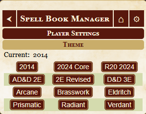

---

## Spell Description Handout


In Choose Spells mode, each spell level header has a **Spell Description Handout** button. Clicking it opens the player's spell description handout.

Each spell has a &#x1F56E; description button. Clicking it writes the formatted spell description to that user's Spell Book Manager handout.

The handout updates live. If the handout is already open when a description button is clicked, the visible handout content should update after Roll20 refreshes the handout display.

---

## Important Notes

Only one GM should edit Spell Book Manager settings at a time. The settings are stored in a shared handout, and simultaneous writes can overwrite or confuse each other.

Do not manually edit the GM Notes of the Spell Book Manager handouts unless you are intentionally repairing settings data.

Assigned spell books are still `SBM_` character sheets. They count toward Roll20 sheet size and performance the same way other spell sources do.

For testing, use clean test characters where possible. Roll20 repeating sections can sometimes leave behind UI artifacts after rows are created, moved, copied, or deleted manually.

---

## Custom Spell Notes

Custom spells that put their own damage or upcast rolls directly in the spell description should not also use the sheet's normal At Higher Levels/upcast fields unless that behavior is intentional.

If the spell description already contains a custom scaling roll, make sure **At Higher Levels** and any higher-level damage fields are blank. Otherwise, Roll20's normal upcast behavior may run in addition to the custom roll in the description.

For custom description-roll spells:

1. Create the spell manually from a blank spell row.
2. Set the spell output type as needed.
3. Leave **At Higher Levels** blank unless you want the sheet's normal upcast behavior.
4. Leave higher-level damage fields blank unless you want the sheet's normal upcast behavior.
5. Put the complete custom roll directly in the spell description.
6. If the custom roll needs to scale by spell level, use `@{spelllevel}` as the default/current level reference instead of hard-coding a default level.

For custom Warlock spells that place their damage roll directly in the spell description, make sure **At Higher Levels** and higher-level damage fields are blank unless you intentionally want Roll20's normal upcast behavior to run as well.

### Example: Hellish Rebuke-style scaling

```text
A creature that damaged you is momentarily surrounded by hellish flames. The creature must make a Dexterity saving throw. It takes [[[[@{spelllevel}+1]]d10]] [[[@{spelllevel}+1]]d10] fire damage on a failed save, or half as much damage on a successful one.
```

This uses `@{spelllevel}` so the roll follows the spell row's current level instead of assuming one fixed spell level.

---

## Troubleshooting

### No characters appear

Make sure the character is a PC, not an NPC, and that the character sheet has normal class attributes. For normal players, the character must be controlled by that player. For GMs, all valid PCs should appear.

Spell Book Manager excludes NPCs, `SBM_` spell sources, and ScriptCards mule characters from the normal player character picker.

### No spell sources are assigned

Open settings as the GM and assign one or more `SBM_` spell sources to the character's class or directly to the character.

### Choose Spells only shows the assigned spell book

This is expected if the character has a spell book assigned. In that workflow, **Choose Spells** copies from the assigned spell book onto the character sheet. Use **Copy to Spell Book** to add spells from approved sources into the spell book first.

### Copy to Spell Book does not appear

The selected character does not have an assigned spell book. Open **GM Settings**, go to **Character Assignments**, choose the character, and assign one `SBM_` character under **Spell Book Assignment**.

### A spell says Already Known

The character already has a spell with the same name on their sheet. Delete or rename the existing spell if you need to copy it again.

### A copied spell has unexpected upcast behavior

Check whether the source spell was created by modifying a compendium spell. For custom description-roll spells, rebuild the spell manually from a blank row and leave Roll20's normal At Higher Levels and higher-level damage fields blank.

### NPC Spell Manager does not list an NPC

Make sure the sheet is a 2014 NPC sheet and not a player character sheet. NPC Spell Manager is GM-only and uses a separate NPC picker instead of the normal player character picker.

### A source does not appear in an available source list

If an `SBM_` character is already assigned as a spell book, it may be excluded from normal available class or character source lists. Remove it as a spell book first if you want to reuse it as a normal shared source.
