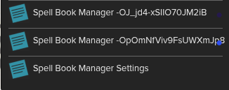
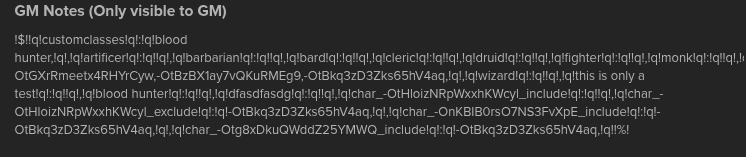
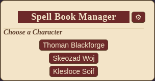
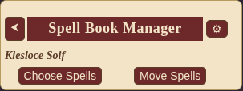
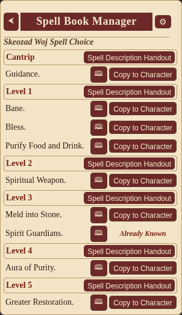
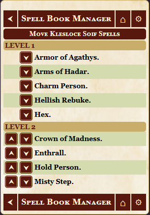
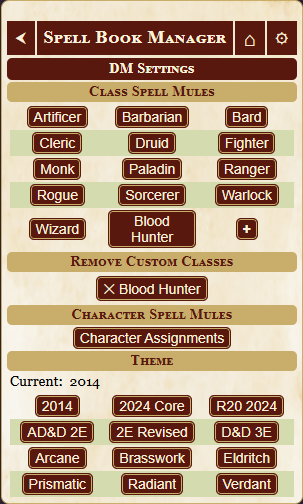
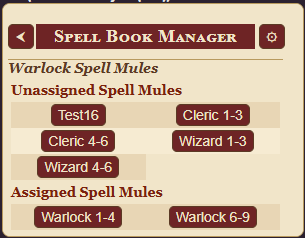
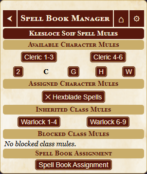
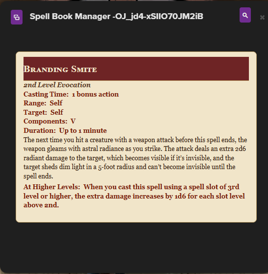

# Spell Book Manager

Spell Book Manager is a ScriptCards utility for Roll20 D&D 5E 2014 games. It lets a GM maintain one or more spell mule characters and lets players copy approved spells from those mules onto their own character sheets. It can also move a character's existing leveled spells up or down between spell levels, which is especially useful for Warlocks and other cases where the same spell may need to live at a different slot level.

The script is designed for the official D&D 5E 2014 by Roll20 character sheet and works with normal PC spell rows. It is not intended for NPC spell management.

---

## Requirements

- A Roll20 Pro account with Mod/API access.
- ScriptCards installed.
- ScriptCards 3.0.22 or newer is recommended.
- The official D&D 5E by Roll20 character sheet.
- One or more spell mule characters whose names begin with `SBM_`.

The script creates and uses handouts for settings and spell descriptions. No manual handout creation is required.

---

## Installation

1. Install ScriptCards in your Roll20 game.
2. Create a new Macro Spell Book Manager.
3. Paste the full `Spell_Book_Manager.scard` script into that Macro.
4. Run the script once as the GM.
5. On first run, the script will create these handouts automatically:
   - `Spell Book Manager Settings`
   - `Spell Book Manager [PlayerID]`

The settings handout stores GM configuration. The player-specific handout is used to display spell descriptions when the spell description button is clicked.

The first time each player runs the script a new `Spell Book Manager [PlayerID]` will be created.<br>


GM's will see a string of characters in the GM Notes of the Handouts. Do not manually edit the GM Notes, that is a JSON string that holds all the mule assignment information.<br>


---

## Spell List Size and Roll20 Performance

Avoid putting too many spells on a single character sheet.

This includes both player characters and `SBM_` spell mule characters. Spell mules are still character sheets, and very large spell lists can make Roll20 slower or less reliable.

There is no exact universal spell limit. Some sheets may work fine with a large number of spells, while others may slow down or behave unpredictably depending on browser, computer, campaign size, and overall sheet data.

For best results, do not create one giant spell mule containing every spell in the game. Split large spell libraries into smaller `SBM_` mule characters, such as class-based, source-based, subclass-based, or campaign-specific spell mules.

If a character sheet or spell mule starts loading slowly, failing to update correctly, or behaving strangely, reduce the number of spell rows on that sheet.

---

## Basic Player Use

Run Spell Book Manager from the macro bar or collections tab.

If the player controls only one valid PC, the script will go directly to that character's spell list. If the player controls more than one valid PC, the script will ask which character to manage.

Players can normally:

1. Choose a character.
2. Click **Choose Spells** to browse available spells from the spell mules assigned to that character. (see Choose Spells section)

3. If the character is a Warlock than **Move Spells** button is also available, which will allow you to move spells from one spell level to another. (see Move Spells sections)<br>


If the character already knows a spell with the same name, Spell Book Manager marks that spell as **Already Known** instead of offering another copy button, but not until the Spell List is refreshed.

---

## Choose Spells



**Choose Spells** shows spells available from assigned spell mules.

1. Click the spell description button to open the Spell Book Manager handout.
1. Click the &#x1F56E; button to view a formatted spell description in the Spell Book Manager handout.
2. Click **Copy to Character** to copy a spell onto the character sheet.

Spell availability comes from two sources:

1. Class spell mules assigned by the GM.
2. Character-specific spell mule settings assigned by the GM.

Spells are grouped by spell level and sorted alphabetically. If multiple assigned mules contain a spell with the same name at the same level, the spell is only shown once in the chooser.

When a spell is copied, the script copies the full spell row to the character sheet and preserves important spell text fields such as name, description, and At Higher Levels text.

---

## Move Spells



**Move Spells** allows a character's existing leveled spells to be moved up or down one spell level at a time.

This is intended mainly for Warlocks or other special cases where spells need to be shifted between spell levels after they are already on the character sheet.

Notes:

- Cantrips cannot be moved.
- Level 1 spells cannot be moved down.
- Level 9 spells cannot be moved up.
- Non-GM players only see **Move Spells** if the selected character appears to be a Warlock.
- GMs can access move mode for any valid PC.

When moving Warlock-style scaling spells, Spell Book Manager attempts to preserve the spell's original baseline level and adjust simple dice expressions when appropriate.

---

## GM Settings



Click the settings button in the Spell Book Manager title bar to open settings.

GM settings include:

- Class spell mule assignments.
- Character-specific spell mule assignments.
- Custom class management.
- Theme selection.

Player settings include:

- Theme selection.

Only the GM sees class mule, character mule, and custom class management options.

---

## Spell Mule Characters

A spell mule is a normal Roll20 character sheet whose name begins with:

```text
SBM_
```

Examples:

```text
SBM_Wizard Spells
SBM_Cleric Spells
SBM_Xanathar Spells
SBM_Custom Warlock Spells
```

Put spells on the mule as normal spell rows at the correct spell level. Spell Book Manager reads those spell rows and offers them to characters based on class and character assignment settings.

The `SBM_` prefix is only for identifying spell mule characters. The prefix is removed from button display names inside the settings menu.

---

## Assigning Class Spell Mules



To assign spell mules by class:

1. Run Spell Book Manager as the GM.
2. Click the settings button.
3. Under **Class Spell Mules**, click a class.
4. Click an unassigned spell mule to assign it to that class.
5. Click an assigned spell mule to remove it from that class.

A character inherits spell mules from any matching class names found on their sheet, including multiclass fields.

---

## Character-Specific Spell Mules



Character-specific settings let the GM add or block spell mules for a specific character.

To manage character-specific spell mules:

1. Run Spell Book Manager as the GM.
2. Click the settings button.
3. Click **Character Assignments**.
4. Choose a character.
5. Use the available, added, inherited, and blocked lists to control that character's spell mule access.

Character-specific mule settings can:

- Add an extra mule that the character does not inherit from class settings.
- Block an inherited class mule for that character.
- Remove a previously added mule.
- Unblock a previously blocked inherited mule.

---

## Custom Classes

The GM can add custom class names from the settings menu.

Use this if your game has a homebrew class, a sheet class name that is not part of the default class list, or a subclass that should have its own spell mule assignments.

Custom class entries are matched against the class and subclass names on a character’s sheet. If the custom entry matches either a character’s class or subclass, Spell Book Manager will apply the mule assignments for that custom entry to that character.

For example, if the GM adds a custom class named Eldritch Knight, then assigns a spell mule to Eldritch Knight, characters with Eldritch Knight as their subclass can inherit that mule assignment the same way a character inherits assignments from a matching class name.

---

## Themes

Spell Book Manager includes multiple visual themes.

Current themes:

- 2014
- 2024
- AD&D2E
- Arcane
- Brasswork
- Eldritch
- Prismatic
- Radiant
- Verdant

Theme selection is stored per user. Players can choose their own display theme without changing the theme for other users.

---

## Spell Description Handout



In Choose Spells mode, each spell has a &#x1F56E; description button. Clicking it writes the formatted spell description to that user's Spell Book Manager handout.

The spell list also includes a **Spell Description Handout** button that opens the handout.

---

## Important Notes

Only one GM should edit Spell Book Manager settings at a time. The settings are stored in a shared handout, and simultaneous writes can overwrite or confuse each other.


---

## Custom Spell Notes

Custom spells that put their own damage or upcast rolls directly in the spell description should not also use the sheet's normal At Higher Levels/upcast fields unless that behavior is intentional.

If the spell description already contains a custom scaling roll, make sure **At Higher Levels** and any higher-level damage fields are blank. Otherwise, Roll20's normal upcast behavior may run in addition to the custom roll in the description.

For custom description-roll spells:

1. Create the spell manually from a blank spell row.
2. Set the spell output type as needed.
3. Leave **At Higher Levels** blank unless you want the sheet's normal upcast behavior.
4. Leave higher-level damage fields blank unless you want the sheet's normal upcast behavior.
5. Put the complete custom roll directly in the spell description.
6. If the custom roll needs to scale by spell level, use `@{spelllevel}` as the default/current level reference instead of hard-coding a default level.

For custom Warlock spells that place their damage roll directly in the spell description, create the spell manually from a blank spell row instead of editing a compendium spell row. Leave At Higher Levels and higher-level damage fields blank.

### Example: Hellish Rebuke-style scaling

```text
A creature that damaged you is momentarily surrounded by hellish flames. The creature must make a Dexterity saving throw. It takes [[[[@{spelllevel}+1]]d10]] [[[@{spelllevel}+1]]d10] fire damage on a failed save, or half as much damage on a successful one.
```

This uses `@{spelllevel}` so the roll follows the spell row's current level instead of assuming one fixed spell level.

---

## Troubleshooting

### No characters appear

Make sure the character is a PC, not an NPC, and that the character sheet has normal class attributes. For normal players, the character must be controlled by that player. For GMs, all valid PCs should appear.

### No spell mules are assigned

Open settings as the GM and assign one or more `SBM_` spell mule characters to the character's class or directly to the character.

### A spell says Already Known

The character already has a spell with the same name on their sheet. Delete or rename the existing spell if you need to copy it again.

### A copied spell has unexpected upcast behavior

Check whether the source mule spell was created by modifying a compendium spell. For custom description-roll spells, rebuild the spell manually from a blank row and leave Roll20's normal At Higher Levels and higher-level damage fields blank.

---