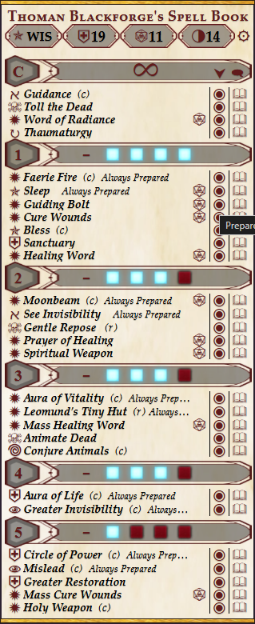
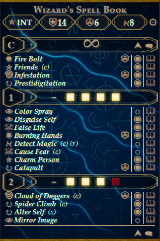
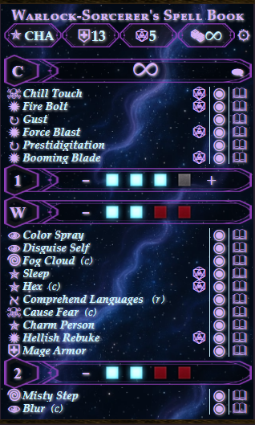
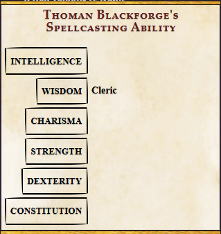
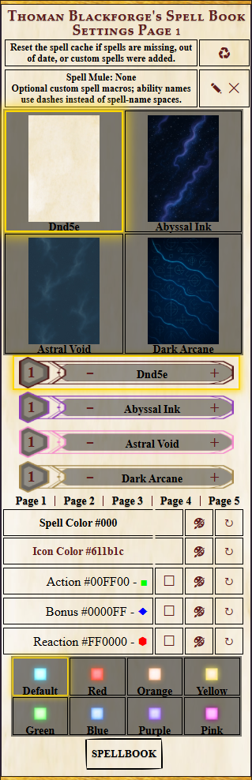

# Spell Book Mod

Spell Book Mod is a ScriptCards-powered spell book interface for the official **D&D 5E 2014 by Roll20** character sheet.

It reads spells directly from the selected character sheet and presents them in a compact, themed spell book in chat. From the card, you can track spell slots, switch between prepared and full spell lists, prepare or unprepare spells, view spell details publicly or privately, cast attack spells, change the character's spellcasting ability, and customize the appearance of the book.



## Features

- Compact spell book generated from the selected character's 2014 sheet.
- Prepared-spell and full-spell views where supported by the class.
- Prepare and unprepare spells directly from the full spell list.
- Spell slot tracking with `+` and `-` controls.
- Pact Magic tracking, including separate Pact Magic and normal slot pools for multiclass characters when needed.
- Native Roll20 spell attack and spell detail output.
- Public or self-whispered spell details.
- Spell school icons, ritual and concentration markers, and optional Action / Bonus Action / Reaction indicators.
- Clickable spellcasting ability with class and multiclass hints.
- 20 spell book themes.
- Independent spell-level UI theme selection.
- Custom spell and icon colours.
- Custom Action / Bonus Action / Reaction marker colours.
- Eight spell slot styles.
- Optional Spell Mule ability overrides for special-case spell macros.
- Automatic per-character caching for fast repeat use.

---

## Requirements

- A Roll20 **Pro** account with Mod/API access.
- **ScriptCards 3.0.23d or newer**.
- The official **D&D 5E 2014 by Roll20** character sheet.
- A token linked to the character sheet you want to use.

Spell Book Mod is written specifically for the 2014 Roll20 sheet. It is not designed for the D&D 2024 sheet.

---

## Installation

1. Install **ScriptCards** from the Roll20 Mod Script Library.
2. Open [`Spellbook_v3.scard`](Spellbook_v3.scard) on GitHub.
3. Click **Raw** and copy the entire script.
4. In Roll20, create a new macro. `Spellbook` is a convenient name.
5. Paste the complete script into the macro.
6. Save the macro.
7. Optionally enable **Show as Token Action** or add the macro to your Macro Bar.

Select one linked character token and run the macro.

### Updating from an earlier version

Replace the entire contents of your existing Spell Book macro with the new `Spellbook_v3.scard` source.

Version 3.7.0 uses a new per-character handout cache system. No cache handouts need to be created manually; Spell Book Mod creates and manages them automatically.

---

## Basic Use

Spell Book Mod requires **exactly one token** to be selected.

The selected token must represent the D&D 5E 2014 character whose spell book you want to open.

When the macro runs, the card reads the character's spellcasting information and spell rows directly from the sheet.


The header shows:

- the current spellcasting ability;
- spell save DC;
- spell attack bonus;
- a class or subclass icon;
- the calculated maximum number of prepared spells, where applicable;
- the Settings button.

Each spell row can show:

- a spell school icon;
- the spell name;
- optional Action, Bonus Action, or Reaction markers;
- concentration `(c)`;
- ritual `(r)`;
- innate spell text, when present;
- a cast button for attack spells;
- the spell's prepared state;
- a Spell Details button.

---

## Prepared and Full Spell Lists

For prepared casters, Spell Book Mod normally opens in a prepared-spell view.

Use the arrow control beside the spell list to show the character's full spell list.



In the full list, the prepared indicator becomes clickable for classes that manually prepare spells:

- `◉` — prepared
- `○` — not prepared

Click the indicator to prepare or unprepare that spell. The character sheet is updated immediately.

Classes that use known spells rather than manually prepared spell lists are treated as always prepared. Classes where a full preparation list is not useful do not show the prepared/full-list switch.

Cantrips are always treated as prepared.

---

## Casting Spells and Viewing Spell Details

Attack spells show a dice button that uses the character's native repeating spell attack roll.

The book button opens the spell's normal Roll20 spell output.

By default, Spell Details are shown publicly in chat. Use the speech / whisper control beside the spell list controls to switch between:

- **public spell details**;
- **whisper spell details to yourself**.

The control can be changed without rebuilding the spell cache.

---

## Spell Slot Tracking

Each spell level displays the character's available spell slots.

Use the `-` and `+` controls to adjust the remaining slots. Changes are written back to the character sheet.


The slot display uses:

- a filled slot for an available slot;
- an empty slot for a used slot;
- a missing slot position when the character does not have that slot.

The slot appearance can be changed in Settings.

### Pact Magic

Spell Book Mod detects Warlock levels from the character's main class or multiclass fields and tracks Pact Magic slots.

For multiclass spellcasters whose normal spell slots and Pact Magic slots share the same spell level, a separate **W** row is shown for Pact Magic.



The normal and Pact Magic slot pools can then be adjusted independently.

---

## Changing Spellcasting Ability

Click the current spellcasting ability in the top-left of the spell book header.

Spell Book Mod opens a Spellcasting Ability card with all six ability scores.



The character's class and multiclass spellcasting abilities are shown beside the appropriate choices as hints.

Selecting an ability updates the character sheet's:

- spellcasting ability;
- spell attack bonus;
- spell save DC.

This is useful for multiclass characters and sheets whose spellcasting ability was not set correctly.

---

## Spell Book Settings

Click the gear button in the spell book header to open the selected character's settings.



Settings are stored per character.

### Spell Mule

The optional **Spell Mule** setting lets you specify a separate Roll20 character whose Abilities are used as custom spell overrides.

Click the edit button beside Spell Mule and enter the exact character name. Click the clear button to remove the configured Spell Mule.

Ability names use the spell name with spaces replaced by dashes.

For example:

```text
Spell: Misty Step
Ability: Misty-Step
```

When Spell Book Mod processes a spell, it checks the configured Spell Mule for a matching Ability. If one is found, both the cast button and Spell Details button run that Ability instead of the normal character-sheet spell output.

This is useful for special-case spells, custom ScriptCards, summons, or any spell that needs behaviour beyond the standard Roll20 sheet roll.

If no Spell Mule is configured, Spell Book Mod checks the selected character for an Ability using the same naming rule. Ability names must match exactly.

Changing or clearing the Spell Mule automatically clears the spell cache. After adding, deleting, or renaming an override Ability on the current Spell Mule, use **Clear Cache** so the spell buttons are rebuilt.

### Themes

Spell Book Mod includes 20 book themes:

- D&D 5E
- Abyssal Ink
- Astral Void
- Dark Arcane
- Ember Core
- Gilded Vine
- Celestial Veil
- Stormcaller
- Sacred Rose
- Chloromancy
- Bloodwake
- Neon Tides
- Whisperveil
- Sanctum Aureum
- Verdant Veil
- Amber Hollow
- Golden Quarry
- Stonecut Vault
- Feymist Bloom
- Circuit Tree

Selecting a theme changes the spell book background and initially applies that theme's matching spell-level UI.

### Independent UI themes

The spell-level header design can be selected independently from the book background.

This allows, for example, one book background with another theme's level-bar design.

### Spell and icon colours

The spell text colour and icon colour can be changed using a custom hexadecimal colour.

The reset button restores the current theme's default colour.

### Action markers

Spell Book Mod can mark spells by casting time:

- **Action** — square
- **Bonus Action** — diamond
- **Reaction** — hexagon

Each marker type can be enabled or disabled independently and can use a custom colour.

### Spell slot styles

Eight slot styles are included:

- Default
- Red
- Orange
- Yellow
- Green
- Blue
- Purple
- Pink

---

## Spell Book Cache

Version 3.7.0 uses an automatic per-character handout cache to make repeat spell book use much faster.

The first time a character or full spell list needs to be built, Spell Book Mod may briefly display a cache-building message.

After the cache is built, normal repeat use should be substantially faster.

Spell Book Mod automatically detects spell rows being added or deleted and detects preparation changes. Only the affected spell levels are refreshed when possible.

### Clear Cache

The Settings page includes a **Clear Cache** button.

Use it when:

- a spell is missing from the book;
- displayed spell information is out of date;
- an existing spell row was edited in place;
- custom spell data changed;
- a Spell Mule override ability was added, deleted, or renamed.

Clearing the cache does **not** reset the character's theme or other Spell Book settings.

### Cache handouts

Spell Book Mod creates archived handouts as needed. Depending on the character's spells and which views have been opened, you may see some of these handouts in the Archive:

```text
Spell Book Cache - [Character ID]
Spell Book Cache 0-1 - [Character ID]
Spell Book Cache 2-3 - [Character ID]
Spell Book Cache 4-5 - [Character ID]
Spell Book Cache 6-9 - [Character ID]
```

Not every character will have all five handouts. Level cache handouts are created only when needed.

Do not manually edit the cache handouts. Use **Clear Cache** from the Spell Book Settings page if the cached spell book needs to be rebuilt.

---

## Class Behaviour

Spell Book Mod uses the character's class to decide how preparation controls should behave.

Known-spell classes are treated as having their listed spells available without manually toggling the Roll20 prepared field.

Prepared casters can switch to the full list and prepare or unprepare spells directly from Spell Book Mod.

The maximum prepared spell value shown in the header is calculated from the character's class level and current spellcasting ability modifier. Paladins and Artificers use half their class level for this calculation. Classes treated as known-spell casters show an infinity symbol instead.

Subclass icons are displayed for a large selection of official 2014 subclasses. An alchemical symbol is used when no matching subclass icon is defined.

---

## Troubleshooting

### No token selected

Select the caster's token and run Spell Book Mod again.

### Multiple tokens selected

Select only one caster token.

### The spell book opens for the wrong character or has missing information

Make sure the selected token represents the intended character and that the character uses the official D&D 5E 2014 by Roll20 sheet.

### A spell is missing or shows old information

Open Settings and click **Clear Cache**.

This is especially important after editing the fields of an existing spell row rather than adding or deleting a row.

### The first full spell list takes longer to open

The full spell list is being built and cached. Later runs use the stored cache.

### I cannot switch to a full spell list

Some known-spell classes intentionally do not show the prepared/full-list control because their spells are treated as always prepared.

### I cannot click the prepared indicator

Preparation dots are only interactive in the full spell list for classes that manually prepare spells.

### Spell Details are going to public chat

Click the speech / whisper control beside the spell list controls. The icon changes when Spell Details are set to whisper to you.

### A Spell Mule macro is not being used

Check all of the following:

1. The Spell Mule character name in Settings exactly matches the Roll20 character name.
2. The ability name matches the spell name with spaces replaced by dashes.
3. The ability name matches exactly, including capitalization.
4. Clear the spell cache after adding, deleting, or renaming the ability.

Example:

```text
Fire Shield
Fire-Shield
```

### Pact Magic slots do not appear separately

A separate `W` row is only needed when Pact Magic slots and normal spell slots exist at the same spell level. For a character using only Pact Magic at that level, the normal level row represents the Pact Magic pool.

### I can see Spell Book Cache handouts

The cache handouts are archived automatically. Leave them in place. They are part of the v3.7.0 cache system.

---

## Version

Current release: **3.7.0**

Author: **Timothy Beasley**

Built with [ScriptCards](https://github.com/kjaegers/ScriptCards) for Roll20.
