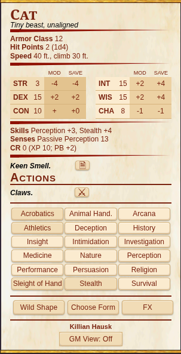
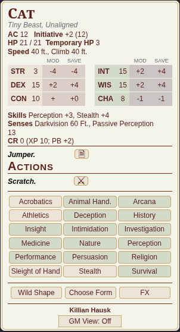
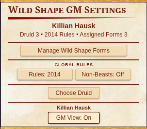
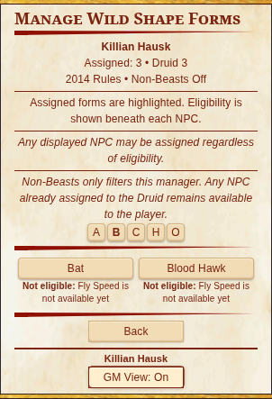
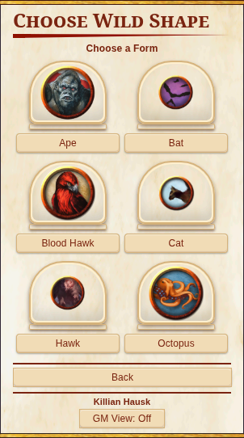

# Tim's Wild Shape Mod

Tim's Wild Shape Mod is a self-contained [ScriptCards](https://wiki.roll20.net/Script:ScriptCards) Wild Shape menu and token manager for Roll20. It officially supports the **D&D 5E by Roll20 (2014)** character sheet and includes experimental compatibility with the **D&D 2024 by Roll20 Beacon** character sheet.

The script gives each Druid a GM-managed list of available forms, displays the selected form as a rollable stat block, replaces the Druid's token while transformed, and restores the original token when the Druid reverts.

> [!IMPORTANT]
> **Beacon support is experimental and is not part of the official ScriptCards release.** It has been tested in Roll20, but it requires the unofficial Beacon-compatible ScriptCards build supplied alongside this project. Beacon functionality and installation requirements may change as official ScriptCards support develops.

<!-- Replace images/wild-shape-overview.png with an overview screenshot. -->
 

## Features

- Official support for the Roll20 2014 character sheet and experimental support for the Beacon character sheet.
- Per-Druid form assignments managed by the GM.
- Automatic Wild Shape eligibility information based on Druid level, challenge rating, and movement speeds.
- Optional support for assigning non-Beast NPCs as forms.
- Clickable form portraits and names with pagination.
- Native Roll20 ability checks, saving throws, skills, traits, and NPC actions.
- Correct Wild Shape ability split: the form supplies physical abilities while the Druid retains mental abilities.
- Automatic token transformation and reversion without modifying the Druid character sheet.
- Per-Druid transformation effects.
- Multi-Druid campaign support.
- GM recovery tools for missing or manually deleted transformed tokens.
- Automatic migration of state created by earlier versions of the script.

## Requirements

- A **Roll20 Pro** subscription with access to Mod (API) Scripts.
- **ScriptCards 3.0.25a**, which is the version used to develop and test this release.
- For a 2014 game, use the official ScriptCards 3.0.25a release.
- Experimental Beacon support requires the unofficial Beacon-compatible ScriptCards build supplied alongside this project. The Wild Shape script relies on its experimental D&D 2024 sheet adapter and native Beacon action support.

Only one copy of ScriptCards should be active in the game. Do not run the standard and Beacon-compatible builds at the same time.

### Experimental Beacon support

The Beacon implementation is included for testing and early use. It has been tested with the D&D 2024 by Roll20 sheet, but it is not currently an official ScriptCards feature. Users who only need the 2014 sheet should install the official ScriptCards release and can ignore the experimental build entirely.

## Installation

### 1. Install ScriptCards

1. Open the Roll20 game.
2. Open **Settings** and select **Mod (API) Scripts**.
3. Install ScriptCards 3.0.25a.
   - For a 2014 game, use the official ScriptCards release.
   - To test the experimental Beacon support, manually install the unofficial Beacon-compatible build supplied alongside this project instead.
4. Save the script and confirm that the Mod sandbox starts without errors.

### 2. Create the Wild Shape macro

1. Open the **Collections** tab in the Roll20 game.
2. Under **Macros**, select **Add**.
3. Name the macro `Wild Shape`.
4. Open `Wild_Shape_mod.scard` from this project.
5. Copy the complete contents of the file into the macro's **Actions** field.
6. Make the macro visible to the players who will use it.
7. Enable **Show as Token Action** or **Show in Macro Bar**, depending on how the group prefers to launch it.
8. Save the macro.

The `.scard` file belongs in a Roll20 macro or character ability. Do not paste it into the Mod (API) Script editor.

## Preparing the game

### Druid characters

Each Druid must:

- Be an unarchived player character controlled by a player.
- Have at least one level in the Druid class.
- Use the same Roll20 sheet system as the game.
- Have a token that represents the correct Druid character sheet.

### Wild Shape NPCs

Each possible form should be an unarchived NPC character in the Journal with:

- A unique and recognizable character name.
- NPC mode enabled.
- A creature type, challenge rating, and movement speeds entered on the sheet.
- A usable default token with a Roll20-hosted image.
- Any traits, actions, bonus actions, reactions, saves, and skills that should appear on the Wild Shape card.

A valid character avatar can be used as a fallback, but assigning a proper default token is strongly recommended. The default token supplies the intended image, dimensions, and 2014 token-bar values.

## Initial GM setup

1. Run the **Wild Shape** macro as the GM.
2. Select **GM View: Off** to turn GM View on.
3. Choose the Druid to configure. If the game contains only one recognized Druid, the script opens that Druid's settings automatically.
4. Select the correct global rules option:
   - **2014 Rules** for the D&D 5E by Roll20 sheet.
   - **2024 Rules** for the experimental D&D 2024 by Roll20 Beacon support.
5. Set **Non-Beasts** to the desired value.
6. Select **Manage Wild Shape Forms**.
7. Use the letter buttons to browse the available NPCs.
8. Select an NPC name to assign or remove it. Assigned forms are highlighted.
9. Return to the main card and turn GM View off when finished.

<!-- Replace images/gm-settings.png with a screenshot of the Wild Shape GM Settings card. -->

<!-- Replace images/manage-wild-shape-forms.png with a screenshot of the form manager. -->

The **Rules** and **Non-Beasts** settings apply to the whole campaign. Form assignments, last-used form, transformation state, and visual effects are stored separately for each Druid.

### Non-Beasts

With **Non-Beasts: Off**, the manager displays NPCs whose creature type contains `Beast`.

With **Non-Beasts: On**, the Beast-type filter is bypassed and any valid NPC can be assigned. Turning the option off again does not remove non-Beast forms that were already assigned.

### Eligibility

The form manager displays whether each NPC meets the normal Wild Shape limits for the selected rule set.

| Druid level | Maximum CR | Swim speed | Fly speed | 2024 known forms |
| --- | ---: | :---: | :---: | ---: |
| 2-3 | 1/4 | 2014: No, 2024: Yes | No | 4 |
| 4-7 | 1/2 | Yes | No | 6 |
| 8+ | 1 | Yes | Yes | 8 |

The known-form limit is displayed only when using the 2024 rules. The script does not prevent the GM from assigning more forms.

Eligibility is informational. The GM can deliberately assign an ineligible form, including one with a higher CR or an unavailable movement speed.

## Player instructions

1. Select a token that represents the Druid character sheet.
2. Run the **Wild Shape** macro.
3. Select **Choose Form**.
4. Select either the portrait or name of the desired form.
5. Review the form's stat block.
6. Select **Wild Shape** to transform.
7. Use the roll buttons and NPC action buttons directly from the form card.
8. Select **Revert** when the transformation ends.

The last-selected form is remembered and opens directly the next time that Druid runs the script. The player can still use **Choose Form** to select a different assigned form.

While transformed, choosing another form and selecting **Wild Shape** replaces the current transformed token with the newly selected form.

<!-- Replace images/choose-wild-shape.png with a screenshot of the Choose Wild Shape card. -->

<!-- Replace images/wild-shape-stat-block.png with a screenshot of a form's rollable stat block. -->

## How rolls work

The script uses native Roll20 sheet actions. It does not construct substitute d20 formulas.

| Roll | Source character sheet |
| --- | --- |
| Strength, Dexterity, and Constitution checks | Wild Shape NPC |
| Strength, Dexterity, and Constitution saving throws | Wild Shape NPC |
| Strength and Dexterity skills | Wild Shape NPC |
| Intelligence, Wisdom, and Charisma checks | Druid player character |
| Intelligence, Wisdom, and Charisma saving throws | Druid player character |
| Intelligence, Wisdom, and Charisma skills | Druid player character |
| Traits, attacks, actions, bonus actions, and reactions | Wild Shape NPC |

When an NPC is assigned to a Druid, the script changes that NPC's roll privacy to public so its native rolls are not whispered to the GM. This is a change to the NPC's sheet-wide roll setting.

## Token transformation and reversion

When Wild Shape is activated, the script creates a token using the selected NPC form's image and dimensions. The transformed token represents the Druid character sheet, allowing the Druid's player to retain control of it.

For ordinary token images, the original token is replaced and recreated when the Druid reverts. If Roll20 is using its non-creatable placeholder image for the original Druid token, the script preserves that exact token on the GM layer during the transformation and restores it during reversion.

The script records the information required to restore:

- Token position and layer.
- Width, height, and rotation.
- Status markers and tint.
- Token bars and their links.
- Vision and lighting settings on recreated tokens.

Avoid manually deleting the transformed token. If it is deleted, use the GM recovery procedure below.

<!-- Replace images/token-transformation.png with a before-and-after token transformation screenshot. -->

## GM View and multiple Druids

The **GM View** control appears only for the GM.

In a multi-Druid game, the GM selects the Druid from the GM card. Token selection is not used to choose which Druid the GM is configuring. The selected Druid's name appears immediately above the GM View button.

The selected Druid is remembered only for the current reentrant menu session. It is not saved as a permanent campaign setting. Starting a new menu session may require choosing the Druid again.

When the GM turns GM View off, the card shows the selected Druid's player-facing menu. This is useful for testing the player's workflow without depending on whichever token the GM may currently have selected.

## Force Revert and recovery

If a Druid has a recorded active transformation, the GM Settings card displays **Force Revert**.

1. Run the macro as the GM.
2. Turn GM View on.
3. Choose the affected Druid.
4. Select **Force Revert**.
5. Read the recovery message and confirm the action.

<!-- Replace images/force-revert.png with a screenshot of the Force Revert confirmation card. -->

Depending on the available tokens and saved state, Force Revert will:

- Restore the preserved original token.
- Replace the recorded transformed token with the original Druid token.
- Clear stale transformation state when the transformed token no longer exists.
- Explain when a legacy placeholder token must be restored manually.

The script prevents changing between the 2014 and 2024 rule sets while any Druid has an active Wild Shape state. Revert or Force Revert every active Druid first.

## Saved data

The script does not create or modify attributes on the Druid character sheet.

It automatically creates archived handouts for its saved data:

- `WildShape_Settings` stores the campaign-wide Rules, Non-Beasts, and GM View settings.
- `WildShape_<character ID>` stores one Druid's assigned forms, last-selected form, effects, and token recovery state.

Do not edit or delete these handouts during normal use. Replacing the macro with a newer version does not remove the saved data.

To completely reset one Druid, make sure the Druid is reverted and then delete that Druid's `WildShape_<character ID>` handout. The script creates a new one the next time it is run for that Druid.

## Visual effects

Select **FX** or **FX Settings** from the player-facing card to choose the transformation effect for that Druid.

Available settings include:

- The default `explode-smoke` effect.
- No transformation effect.
- A selected Roll20 effect type and color.

The setting is stored separately for each Druid.

## Troubleshooting

### No Druids are found

Confirm that the character:

- Is not archived.
- Is controlled by a player.
- Is a player character rather than an NPC.
- Has a Druid class entry and a positive Druid level.
- Uses the game's selected sheet system.

### No NPCs are available in Manage Wild Shape Forms

Confirm that the NPC:

- Is not archived.
- Has NPC mode enabled.
- Has a usable default token or character avatar.
- Has `Beast` in its creature type, or that **Non-Beasts** is turned on.

### The GM player view cannot find the Druid token

Place exactly one token representing that specific Druid character sheet on the campaign player page. If a copied token represents the wrong character sheet, open its token settings and correct the **Represents Character** field.

### A button reports "No action available"

Confirm that:

- The correct version of ScriptCards is installed.
- Beacon games are using the unofficial Beacon-compatible experimental build rather than the official ScriptCards release.
- The NPC and Druid use the expected Roll20 character sheet.
- The requested action exists on the source character sheet.

### Token Replacement Failed

Make sure the form has a usable Roll20-hosted default-token image. If Roll20 created an extra token even though the script displayed an error, delete the extra token before trying again.

### Rules cannot be changed

At least one Druid still has an active Wild Shape state. Revert that Druid normally or use **Force Revert** from GM View.

Before deleting or archiving a Druid character, revert it first. If the character was already deleted while transformed, remove its orphaned archived `WildShape_<character ID>` handout to clear the obsolete active state.

## Updating

1. Revert every transformed Druid before updating.
2. Open the Roll20 **Wild Shape** macro.
3. Replace the complete macro action with the complete contents of the new `.scard` file.
4. Save the macro.
5. Do not delete the existing `WildShape_Settings` or per-Druid handouts.

After updating, briefly test:

- Opening the GM settings and assigned-form manager.
- Opening a player-facing form card.
- One native NPC roll and one native Druid roll.
- One complete transform and revert cycle.

## Credits

Created by **Timothy Beasley** for Roll20 and ScriptCards.
